### Hi there 👋

 
    

 

## Self Introduction

A shachiku enthusiast immersed in the world of open-source projects.

**Currently buried under work commitments and unavailable.**

I have a smattering of knowledge across various fields, but I haven't truly excelled in any.

## 🛠️ &nbsp;Tech Stack

More...

## 🖥️ &nbsp;Operating System

More...

<!--  -->

<!--  -->

## Profile views

<!--  -->
